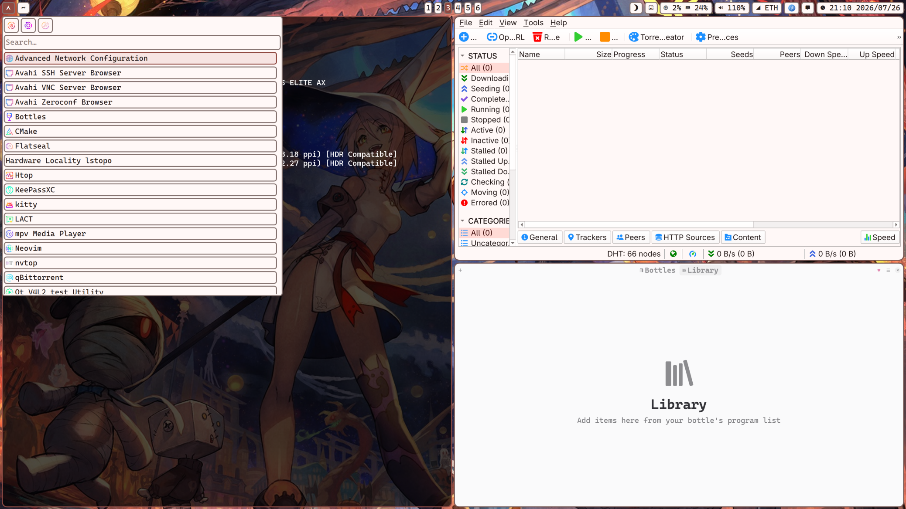
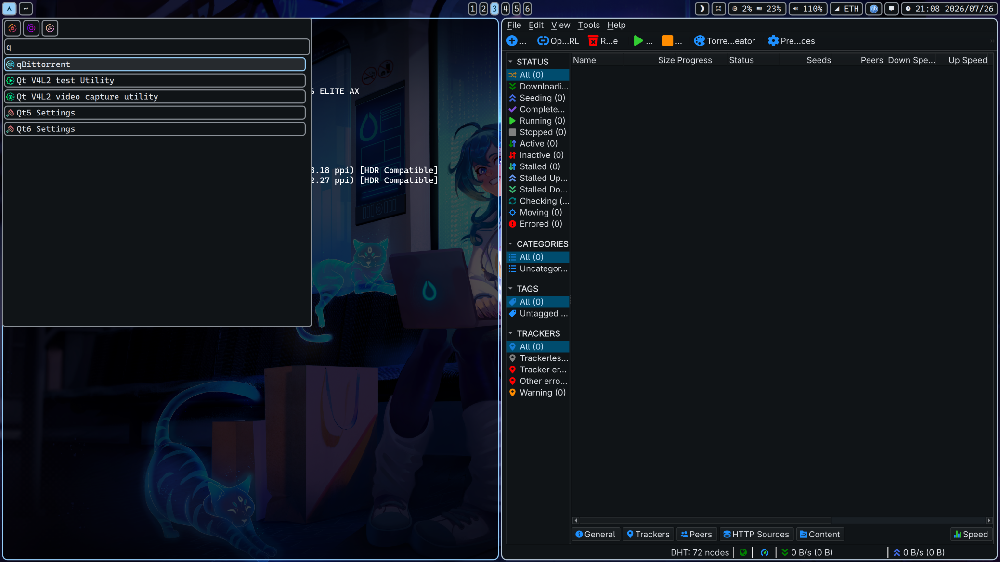

# simple-linux

> Bare-metal Arch Linux to a fully-themed Hyprland desktop. Encrypted, signed, and self-maintaining.

**simple-linux** is a two-phase setup that takes a machine from Arch ISO boot to a complete desktop environment, then keeps it updated and themed — all without touching root for day-to-day management.

- **[system-setup/](system-setup/)** — Root-level Arch installer: LUKS2 + Btrfs + UKI + Secure Boot + Hyprland
- **[user-setup/](user-setup/)** — Per-user dotfiles, theming engine, custom package manager, and CLI toolkit (never needs sudo for day-to-day operations)

## Preview

  
  &nbsp;
  

<em>Material Design 3 theming with light/dark mode switching, powered by matugen</em>

## Feature Highlights

- **Full disk encryption** — LUKS2 on Btrfs subvolumes (`@`, `@home`, `@swap`, `@var_log`, `@var_cache_pacman`)
- **Unified Kernel Images** — UEFI direct boot, no bootloader; signed with custom Secure Boot keys
- **Material Design 3 theming** — matugen-powered palette extracted from wallpaper, injected into every UI surface
- **User-level package manager** — PKGBUILD-like format, installs into `$HOME`, manifest-tracked, never needs sudo for day-to-day operations
- **Custom desktop shell** — Quickshell (Qt/QML): status bar, notifications, app menu, wallpaper browser
- **CLI toolkit** — backups (restic), containers (nerdctl/compose), git identity switching, and more
- **Idempotent** — every script is safe to run repeatedly

## See Also

- [system-setup/README.md](system-setup/README.md) — Full install documentation, prerequisites, quick start, and all `settings.env` options
- [user-setup/README.md](user-setup/README.md) — User setup, controller commands, theming pipeline, package manager, CLI tools, and desktop components
- [Wallpaper attributions](user-setup/.config/simple-linux/files/README.md)
